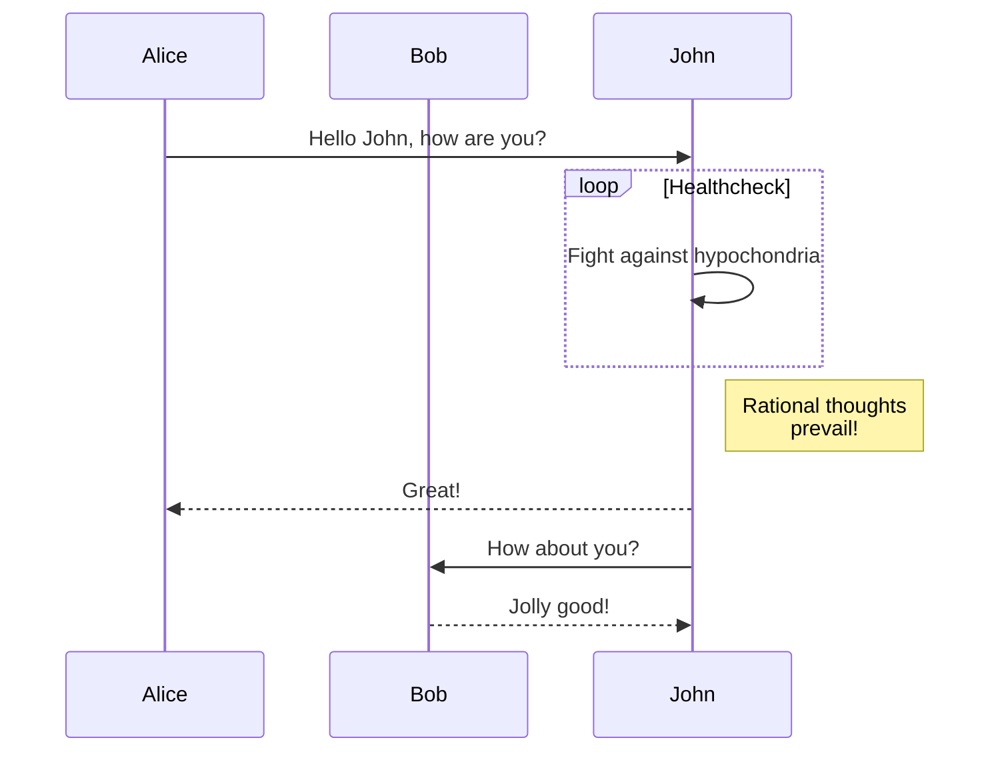

# Tutorial Intro

Let's discover **Docusaurus in less than 5 minutes**.

## Getting Started

Get started by **creating a new site**.

Or **try Docusaurus immediately** with **[docusaurus.new](https://docusaurus.new)**.

## Generate a new site

Generate a new Docusaurus site using the **classic template**:

```bash
npm init docusaurus@latest my-website classic
```

## Start your site

Run the development server:

```bash
cd my-website
npm run start
```

## Drawing Diagrams with Mermaid

Docusaurus supports diagrams and flowcharts using [Mermaid](https://mermaid.js.org/). To enable Mermaid, install the plugin:

```bash
npm install @docusaurus/theme-mermaid
```

Then update your `docusaurus.config.js`:

```js
module.exports = {
    // ...
    themes: ['@docusaurus/theme-mermaid'],
    markdown: {
        mermaid: true,
    },
    // ...
};
```

Now you can create diagrams using mermaid code blocks:


You can also create flowcharts, sequence diagrams, and more:




Your site starts at `http://localhost:3000`.
